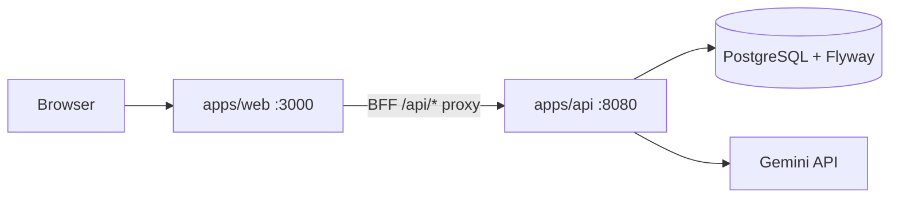

# RapidSD Architecture

RapidSD is a system-design practice application organized as a lightweight monorepo.

## System overview



## Repository layout

| Path | Purpose |
|------|---------|
| `apps/web` | Next.js 15 frontend (App Router, React 19, TanStack Query) |
| `apps/api` | Spring Boot 3.5 REST API (Java 21) |
| `public/` | Legacy PWA manifest only; real static assets live in `apps/web/public` |
| `docs/` | Architecture and AI handoff documentation |

## Backend layers

```
controller/     HTTP endpoints (one controller per resource)
service/        Business interfaces
service/impl/   Business implementations
repository/     Spring Data JpaRepository interfaces
entity/         JPA @Entity classes mapped to Flyway schema
dto/            Request/response records (auth, profile, catalog, practice, grading)
mapper/         Entity ↔ DTO conversion
security/       JWT filter, SecurityConfig, JwtService
exception/      ApiException + @RestControllerAdvice handler
```

**Rules:**
- Controllers return DTOs only, never entities.
- Services depend on repository interfaces and mappers.
- Flyway owns the schema; Hibernate uses `ddl-auto: validate`.
- No JDBC (`JdbcTemplate` / `JdbcClient`) — JPA only.

## Frontend architecture

- Browser calls relative `/api/*` routes on the Next.js server.
- `apps/web/src/app/api/[...path]/route.ts` proxies to Spring Boot.
- `server-api.ts` attaches JWT from httpOnly cookie `rsd_access`.
- Login/signup responses set cookies from `accessToken` / `refreshToken` fields.
- `middleware.ts` guards authenticated routes by checking `rsd_access`.

## Database

PostgreSQL 15+ with tables: `app_users`, `profiles`, `password_reset_tokens`, `categories`, `questions`, `answer_keys`, `user_card_state`, `attempts`, `favorites`.

Schema and seed data: `apps/api/src/main/resources/db/migration/V1__*.sql`

## Running locally

```bash
cp .env.example .env   # edit values
npm install
npm run docker:db      # optional: Postgres only
npm run dev:api
npm run dev:web
```

## Running with Docker

```bash
cp .env.example .env
npm run docker:up
```

Open http://localhost:3000

## Naming

| Context | Name |
|---------|------|
| Repo folder | `systemflash` |
| npm package | `rapidsd` |
| Java package | `dev.designdeck.api` |
